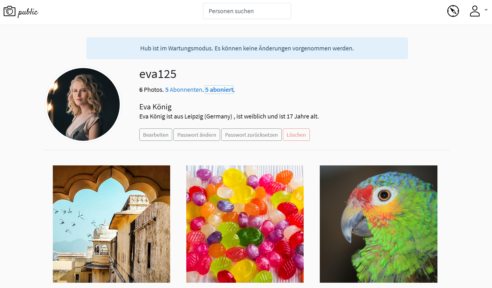
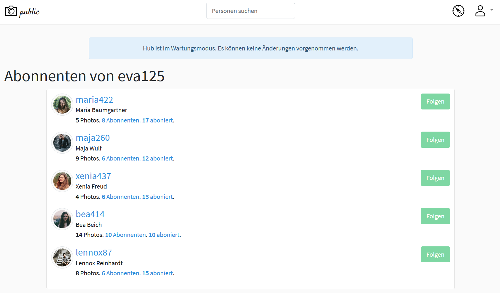
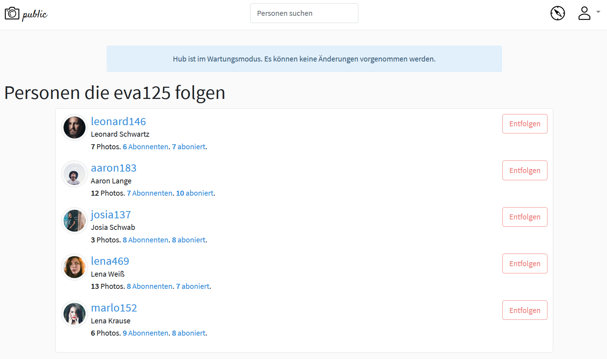
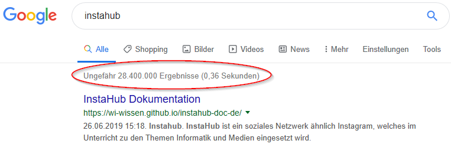
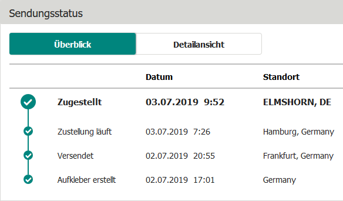
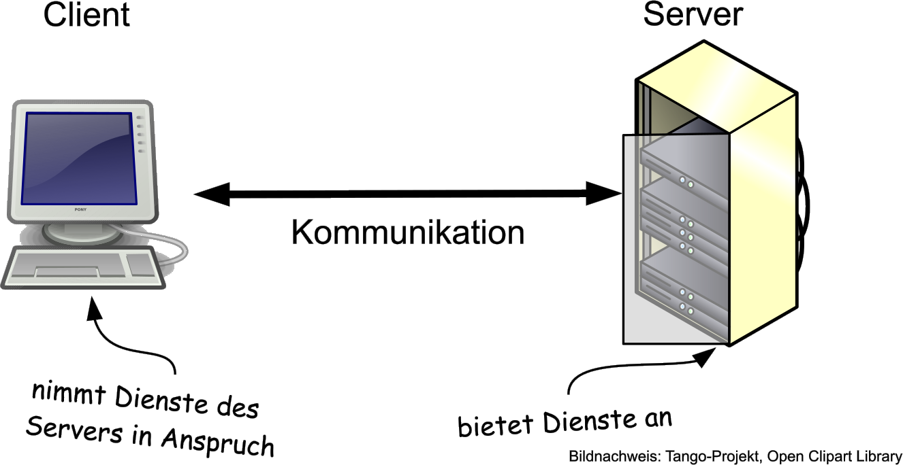

# Bevor es los geht

# Bevor es losgeht:  Datenschutzhinweise

Die folgende Erklärung wurden mit dem Datenschutzbeauftragen Schule des Ministeriums für Bildung, Wissenschaft des Landes Schleswig-Holstein für das Land Schleswig Holstein abgestimmt. Spätere Änderungen durch den Betreiber von InstaHub werden von der InstaHub einsetzenden Schule überprüft.

----

**Liebe Erziehungsberechtigte, liebe Schüler\*innen,**

im Rahmen der Umsetzung KMK-Strategie "Bildung in der Digitalen Welt" beschäftigen wir uns im Unterricht im Fach Berufliche Informatik / Informationstechnik / EDV / Informatik mit dem Schutz persönlicher Daten und wollen in diesem Zusammenhang einen Blick hinter die Kulissen eines sozialen Netzes werfen. 

Wir werden mit InstaHub arbeiten, einem sozialen Netz, das Instagram ähnelt. Anders als Instagram lässt InstaHub uns hinter die Kulissen blicken. So gewinnen die Schüler:innen Einblicke in die Arbeitsweise von sozialen Netzen.

InstaHub (https://instahub.org/) ist ein mit mehreren Preisen versehenes Projekt eines deutschen Informatiklehrers. Der Server wird DSGVO-konform betrieben. Nähere Informationen entnehmen Sie bitte der Website des Projektes.

Die Schüler\*innen/Sie erhalten einen Zugang zu einem eigenen InstaHub, der bereits eine Fülle Daten und Fotos von fiktiven Personen enthält. Genauso fiktiv sind die Werbeanzeigen, die den Schüler:innen/Ihnen angezeigt werden, denn InstaHub ist werbefrei.

Es besteht die Möglichkeit, den eigenen InstaHub für andere Personen freizuschalten und Fotos hochzuladen und zu kommentieren und ggf. auch auf InstaHubs der Mitschüler:innen aktiv zu werden.

Ich werde die Schüler:innen darauf hinweisen/Ich weise Sie darauf hin, dass sie

- wir mit Pseudonymen arbeiten und außer der Lerngruppenbezeichnung keinerlei persönliche Daten eingegeben werden dürfen,
- beim Hochladen und Kommentieren von Fotos das Urheberrecht und die Persönlichkeitsrechte beachtet werden müssen,
- die Zugangsdaten auf keinen Fall außerhalb der Lerngruppe verbreitet werden dürfen und
- ich alle eingegebenen Daten sehe und stichprobenartig kontrolliere.

**Liebe Erziehungsberechtigte**, ich bitte Sie, dies auch noch einmal von Ihrer Seite mit Ihrem Kind zu besprechen. Vielen Dank. 

Alle InstaHubs werden von mir gelöscht, wenn sie unterrichtlich nicht mehr benötigt werden. Sie sind dann unwiederbringlich gelöscht. 

Für Rückfragen stehe ich jederzeit gerne zur Verfügung. Erziehungsberechtigte wenden sich bitte an das Schulbüro, Schüler:innen sprechen mich bitte im Unterricht an.

| Lehrkraft                       | Erziehungsberechtigte           | Schüler\*in                     |
| ------------------------------- | ------------------------------- | ------------------------------- |
|                                 |                                 |                                 |
|                                 |                                 |                                 |
|                                 |                                 |                                 |
|   Datum, Unterschrift |   Datum, Unterschrift |   Datum, Unterschrift |

## Quelle:  {.unnumbered}

- KMK (Hrsg.): Bildung in der digitalen Welt. Strategie der Kultusministerkonferenz. 2017. Verfügbar unter https://www.kmk.org/fileadmin/Dateien/veroeffentlichungen_beschluesse/2018/Strategie_Bildung_in_der_digitalen_Welt_idF._vom_07.12.2017.pdf

## InstaHub?

InstaHub ist ein soziales Netz, das Instagram ähnelt. Es gibt aber einen ganz wichtigen Unterschied: Anders als Instagram lässt InstaHub Sie hinter die Kulissen blicken. So gewinnen Sie Einblicke in die Arbeitsweise von sozialen Netzen und lernen ganz nebenbei, wie Datenbanken funktionieren.

Die folgenden Screenshots geben Ihnen einen Eindruck davon, was Sie in InstaHub erwartet:

InstaHub funktioniert also fast wie Instagramm. Inklusive Werbung. Der entscheidende Unterschied ist, dass alles in InstaHub fiktiv ist. Die Menschen gibt es genauso wenig wie die Unternehmen, die die Werbung schalten.

Unter https://instahub.org/#guest können Sie sich schon einmal umsehen.

## Datenbanken?

Eine Datenbank ist wie eine Bank, der man sein Geld bringen kann. Nur eben für Daten. 
Das schöne an einer Bank ist, das man ihr sein Geld anvertrauen kann, und es auch wieder bekommt, wenn mann will:

Bei einer Datenbank ist es ganz ähnlich, nur dass die Benutzer:innen statt Geld dort Daten abgeben und wiederholen:

## Datenbanken sind überall

Programme, die Datenbanken verwalten, heißen **Datenbankmanagementsysteme** (DBMS). Kleinere DBMS sind Microsoft Access oder Libre Office Base. Größere DBMS sind MySQL und der MS SQL-Server.

Im Grund stellen die meisten DBMS lediglich die Möglichkeit bereit, gigantische Tabellen zu erstellen und sie in Windeseile zu verknüpfen. 

Wenn Sie zum Beispiel mit Google[^10] nach "instahub" suchen, schlägt Google in seinen Datenbanken nach und stellt in 0,36 s fest, dass sie fast 30 Millionen Treffer hat:

[^10]: Die anderen Suchmaschinen machen es genauso, aber die Zeit gibt nur Google aus... 

Kein Onlineshop kommt ohne Datenbanken aus - z. B. für die Produktpräsentation und die Verwaltung der Bestellungen:

Aber auch beim Versand der Ware geht nichts ohne Datenbanken:

#### Aufgabe 2.1: Datenbanken sind überall {-}

*Überlegen* Sie: Wo sind Sie in den letzten Tagen wohl Datenbanken begegnet? Wo *vermuten* Sie Datenbanken, die Informationen über Sie speichern?

## Eigenschaften von DBMS

### Warum Datenbanken, wir haben doch Tabellenkalkulationen!

Wenn  die meisten Datenbanken aus lauter Tabellen bestehen, drängt sich die  Frage auf, warum wir dafür nicht einfach eine Tabellenkalkulation wie z. B. Microsoft EXCEL oder Libre Office Calc verwenden. Hier also die wichtigsten Gründe für die Verwendung von  Datenbankmanagementsystemen (DBMS):

### Viele Köche verderben nicht immer den Brei

DBMS ermöglichen in der Regel zahlreichen Benutzer:innen gleichzeitig den Zugriff auf die gespeicherten Daten. Man spricht auch von **Mehrbenutzerfähigkeit**.

Mehrere Benutzer:innen können also zeitgleich auf eine Tabelle zugreifen,  eventuell sogar auf die selbe Zeile (Bei Datenbanken spricht man von *Datensatz*). Tabellenkalkulationen  erlauben dies in der Regel allenfalls zum lesen.

Über diese Möglichkeit verfügen zwar zunehmend auch Tabellenkalkulationen, aber nur in eingeschränkter Weise und nich für eine große Zahl gleichzeitiger Zugriffe.

### Was ich darf, darfst Du noch lange nicht!

DBMS erlauben **Zugriffsbeschränkungen**. Das heißt, dass nicht alle Benutzer:innen über die selben Rechte verfügen. Einige typische Rechte sind z. B.:

- Erstellen neuer Tabellen
- Ändern der Struktur bestehender Tabellen
- Datensätze ansehen
- Datensätze einfügen
- Datensätze löschen
- Datensätze verändern

### Jedem das Seine

DBMS  müssen den unterschiedlichen Bedürfnissen und Fähigkeiten der Benutzer:innen Rechnung tragen und für jede Benutzergruppe unterschiedliche  Schnittstellen zur Verfügung stellen. Man spricht von **Mehrbenutzerschnittstellen**.  Z. B. gibt es Oberflächen für gelegentliche Nutzer:innen, oder Schnittstellen  für die Programmierer:innen von Datenbankanwendungen oder hochentwickelte  Anfragesprachen für versierte Nutzer:innen mit sehr speziellen  Informationsbedürfnissen.

### Ich sehe was, was Du nicht siehst!

DBMS  ermöglichen die Einrichtung von Datensichten (*views*), d. h.  unterschiedlicher Perspektiven auf die Datenbank. So könnte z. B. jede:r  Dozent:in einer Universität eine Liste aller Teilnehmer:innen seines Kurses  inklusive der vorher besuchten Kurse sehen, obwohl diese Daten in vielen  Tabellen verstreut liegen.

### Lass mich mal abschreiben!

Wie viele Stellen im Betrieb benötigen eigentlich die Adresse eine:r Kund:in? Mindestens folgende:

- Kundenbuchhaltung,
- Versand und
- Marketing.

Dieses mehrfache Speichern derselben Sachverhalte nennt man *Redundanz*. (lat. *redundare* „im Überfluss vorhanden sein“). Redundanz bringt Probleme mit sich: 

- Wenn  ein- und dieselben Daten an verschiedenen Stellen gespeichert sind,  werden Daten mehrfach erfasst (mehrfacher Zeitaufwand) und mehrfach  gespeichert (mehrfacher Speicherplatz). 
- Das wäre noch nicht  so schlimm. Es gibt noch ein viel größeres Problem: Das  der Inkonsistenz. (lat.: *in* nicht, *con* zusammen, *sistere* halten) Die  Wahrscheinlichkeit ist groß, dass irgendwann Versand und  die Kundenbuchhaltung unterschiedliche Adressen verwenden, weil der Kunde  umgezogen ist, aber einer von beiden das nicht mitbekommen hat. Die Pakete gehen dann z. B. schon an die neue Adresse, während die Rechnung an die alte Adresse geht.

DBMS sollten über eine **Redundanzkontrolle** verfügen, so dass bei (manchmal unvermeidlicher) redundanter Speicherung von Daten Inkonsistenzen verhindert werden.

### Beziehungskisten

Die  Tabellen einer Datenbank hängen untereinander logisch zusammen. DBMS  unterstützen diese komplexen Beziehungen, in dem sie diese Beziehungen  verwalten und effizient miteinander verbinden und aktualisieren  können. Z. B. dient die Personalnummer in vielen Tabellen der  Personalabteilung zur Identifizierung eines Mitarbeiters. Diese **Beziehung zwischen Daten** nennt man auch **Relation**. Sie ist so wichtig, dass die wichtigste Gruppe von DBMS sogar nach ihr benannt wurde: Die **relationalen Datenbanken**. Instahub liegt eine solche relationale Datenbank zu Grunde. Auch Access und Base sind relationale Datenbanken.

### Vertrauen ist gut, Kontrolle besser!

Datenbanken können in DBMS so definiert werden, dass bestimmte **Integritätsbedingungen** (Integrität: lat. *integritas* „unversehrt“,  „vollständig“) zu jedem Zeitpunkt eingehalten sein müssen. Auf diese  Weise kann z. B. sicher gestellt werden, dass jeder Kurs eine*n Dozent\*in  bekommt und kein\*e Student\*in einen Kurs belegen kann, den es gar nicht gibt.

### Daten, Daten, Daten – soweit das Auge reicht!

DBMS  sind darauf ausgerichtet, mit sehr großen Datenmengen umgehen zu  können. Das Selektieren von tausenden Datensätzen aus einer Datenbank  mit Millionen von Datensätzen dauert in modernen DBMS nur Bruchteile von  Sekunden.

### Sicher ist sicher!

Sollte  es zu einem Problem mit dem DBMS kommen, z. B. wegen eines Soft- oder  Hardwarefehlers, sorgen DBMS durch geschickte Speicherung der Daten auf  der Festplatte für die Möglichkeit, auf einem korrekten Zustand kurz vor  Entstehen des Problems wieder aufzusetzen. (**Recovery**)

#### Aufgabe 2.2: Eigenschaften von DBMS {-}

*Erstellen* Sie eine Tabelle, in der Sie zu jeder in diesem Abschnitt genannten Eigenschaft von DBMS ein Beispiel aus einem Warenwirtschaftsystem eines Unternehmens finden. Warenwirtschaftssysteme dienen zur Abbildung der Warenströme in Unternehmen.

## Die Client-Server-Architektur

Es vermeidet Missverständnisse, wenn wir vor der Arbeit mit InstaHub noch einen Blick auf die Client-Server-Architektur (oft auch: Client-Server-Modell) werfen.

Den Begriff "Server" kennen sie bestimmt bereits. Zum Beispiel wissen Sie, dass ein Server ausfallen kann und dann etwas nicht mehr funktioniert, auf das Sie dringend angewiesen sind.

Beispiel: Herr Ölgemöller arbeitet in der Buchhaltung der Hausverwaltung Sörkeling. In seinem Büro befindet sich ein Drucker, auf den er über das lokale Netz (LAN) zugreift. Der Druckserver ist ausgefallen. Obwohl sowohl sein Rechner als auch der Drucker dienstbereit sind, kann Herr Ölgemöller nicht drucken, da der vom Server angebotene Dienst "Drucken" nicht verfügbar ist.

Bei der Client-Server-Architektur gibt es mindestens zwei IT-Systeme. Das eine ist der Server, der Dienste anbietet und das andere ist der Client, der diese Dienste in Anspruch nehmen kann. Meist greifen mehrere Clients auf einen einzigen Server zu. 

In einem IT-Lexikon liest sich das dann so:

> **Client-Server-Architektur** (engl.: *client-server architecture*) Kooperative Form der Informationsverarbeitung bei der sich ergänzende Softwarekomponenten meist (aber nicht zwangsläufig) auf unterschiedliche Rechner verteilt werden, die über ein Rechnernetz verbunden sind. Ein Client-Server-System ist eine einfache Form eines verteilten Systems, bei dem die Rollenverteilung zwischen dem Serverprogramm und Klientenprogramm statisch ist und meist eine 1:n-Beziehung darstellt. (Vgl. Hansen, S. 64)

Beachten Sie: Client und Server sind im Sinne der Client-Server-Architektur *Softwarekomponenten* und keine *Hardware* (Geräte)!  Daher können Client und Server auch durchaus auf ein- und demselben Rechner laufen. Z. B. wird bei der Entwicklung von Websites gerne auf das Packet XAMP zurück gegriffen. Es stellt einen vollen Webserver zur Verfügung , der u.a. aus den folgenden Komponenten besteht:

+ HTTP-Server 
+ Datenbankserver
+ Mailserver

Wenn es InstaHub nicht gebe, wäre der Einsatz von XAMPP eine Möglichkeit, im Unterricht mit Datenbanken zu arbeiten. Wir arbeiten aber mit Instahub. Jede:r Schüler:in wird im Browser (=Client) die Website von Instahub aufrufen und dort Datenbankabfragen an den Server senden. Sie brauchen den Inhalt Ihres Instahubs also nicht auf einem USB-Stick zu speichern. Ihre Daten sind immer auf dem Server. Alles was Sie brauchen, ist ein Internetfähiger Rechner und eine Internetverbindung.

## Quellen zu diesem Kapitel {.unnumbered}

+ Abschnitt [Eigenschaften von DBMS]:
  + *Elmasri*, Rami und Shamkant B. Navathe: Grundlagen von Datenbanksystemen. Ausgabe Grundstudium. 3. Auflage. Pearson. S. 24-35.

+ Abschnitt [Die Client-Server-Architektur]: 
  + *Hansen*, H. R. und Neumann, G.: Arbeitsbuch Wirtschaftsinformatik. IT-Lexikon, Aufgaben, Lösungen. UTB. 7. Auflage. 

