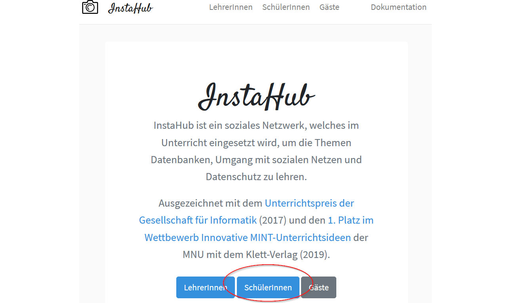
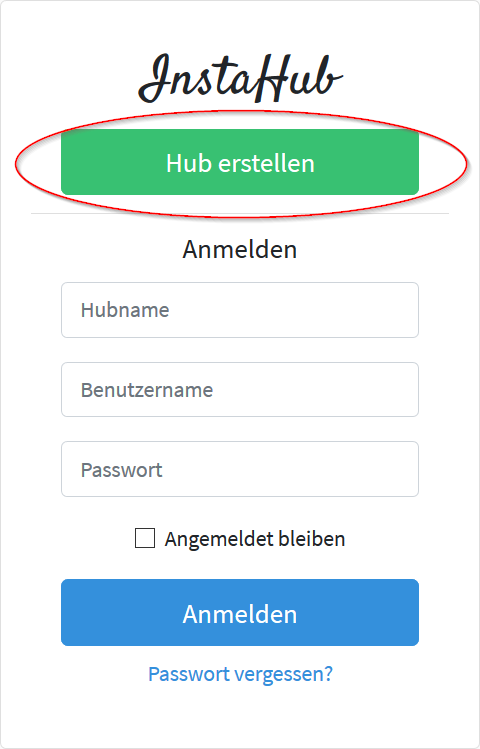
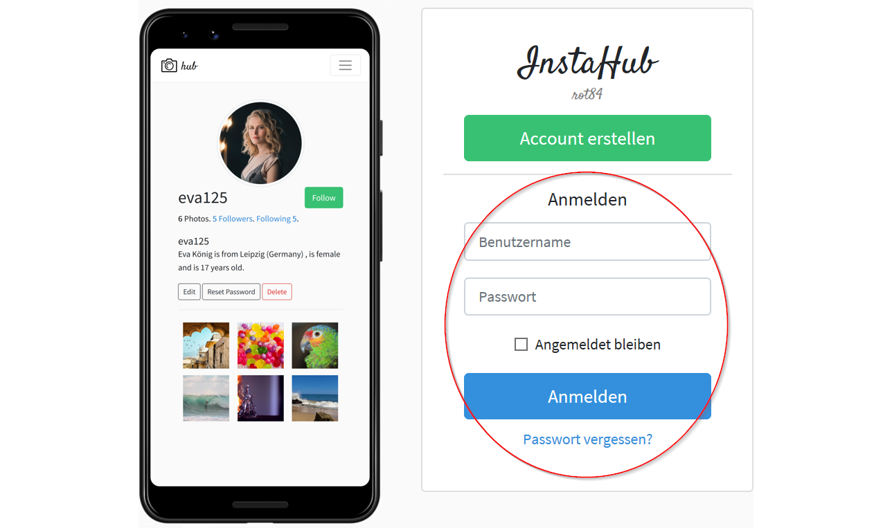
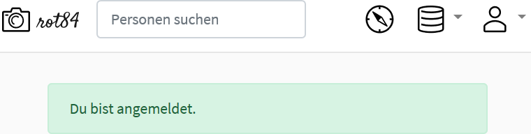
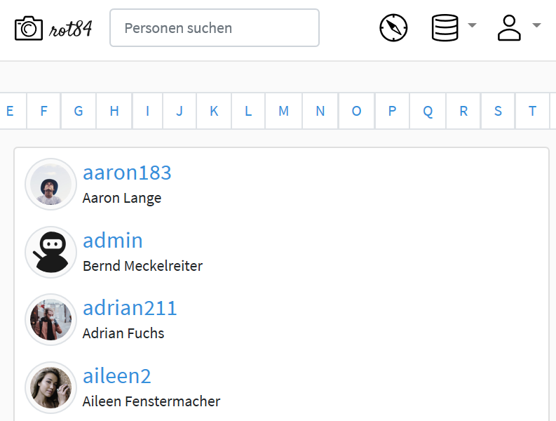
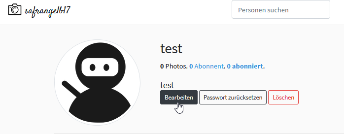
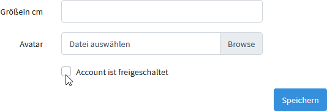

# Erste Schritte mit InstaHub

## Den eigenen Hub erstellen

#### Aufgabe 3.1: Beantragen Sie einen eigenen InstaHub! {-}

Zur Arbeit mit InstaHub arbeitet jede\*r Schüler\*in auf einem eigenen InstaHub. Es hat also jeder sein eigenes soziales Netzwerk.

Um einen InstaHub zu beantragen, gehen Sie wie folgt vor:

1. *Rufen* Sie InstaHub in Ihrem Browser (**nicht** Internet Explorer!)[^20] auf: https://instahub.org/!

   [^20]: InstaHub unterstützt alle gängigen Browser mit Ausnahme des Internet Explorers.

2. *Klicken* Sie unten mittig auf den Button `SchülerInnen`:

3. Klicken Sie auf `Hub erstellen`:

4. Sie sehen das folgende Formular (Ausschnitt):

5. _Notieren_ Sie sich __jetzt__ den Namen Ihres InstaHubs (im Beispiel: `rubinrot18`): ______________________.

6. _Tragen_ Sie unter `Dein/e LehrerIn` den InstaHub-Namen Ihrer Lehrkraft ein. Dies ist ______________________

7. Unter `Name` (_nicht_ Benutzername!) tragen Sie bitte Ihre Klasse gefolgt Ihrem mit Ihrer Lehrkraft abgesprochenen Pseudonym ein. 

   Wenn Ihr Pseudonym Hermine ist und Sie in die Klasse BOM19-3 gehen, tragen Sie ein: `BOM19-3 Hermine `.

   _Tragen_ Sie in den folgenden Feldern Angaben ein wie Sie wollen. Denken Sie sich etwas aus, aber nehmen Sie nicht Ihre echten Daten. 

   Die E-Mail-Adresse ist allerdings hilfreich, um das Passwort zurücksetzen zu können. Wenn Sie auf diese Funktion verzichten können, brauchen sie Ihre E-Mail-Adresse nicht einzugeben.

9. Wählen Sie ein sicheres Passwort. 

10. _Senden_ Sie Ihre Registrierung durch einen Klick auf `Register`ab und *warten* Sie nun darauf, dass Ihre Lehrkraft Ihren InstaHub frei schaltet. Erst danach kann es für Sie weiter gehen!

## Am eigenen InstaHub anmelden

#### Aufgabe 3.2 Verwenden Ihres eigenen InstaHubs {-}

Nachdem Ihre Lehrkraft Ihren InstaHub nun freigeschaltet hat, können Sie Ihren eigenen InstaHub verwenden. Gehen Sie dazu wie folgt vor:

1. Melden Sie sich unter https://rubinrot18.instahub.org/login anmelden, wobei Sie `rubinrot18` durch den Namen Ihres InstaHubs ersetzen. Zum Glück haben Sie sich vorhin den Namen Ihres InstaHubs notiert... Ihr Benutzername lautet `admin`.

2. Nach dem erfolgreichen Login sehen Sie die derzeit noch recht leere Startseite von InstaHub:

   Sie erreichen die Startseite immer wieder, wenn Sie auf das **Fotoapparat-Symbol** oben links klicken.

3. Ein Klick auf das **Kompass-Symbol** bringt Sie zur Nutzerübersicht:

   Wie Sie sehen Sie, haben sich ganz ohne Ihr Zutun schon etwa 200 Nutzer\*innen an Ihrem InstaHub angemeldet.[^21]

[^21]:Keine Angst, diese Nutzer\*innen wurden beim Anlegen Ihres InstaHubs angelegt. Es handelt sich **nicht** um echte Menschen. Die Fotos stammen aus Qullen, die den freien Einsatz der Fotos erlauben.

4. Vielleicht werden Sie enttäuscht sein, denn InstaHub ist ja derzeit frei von Fotos. Es gibt irgendwie nur Nutzer\*innen, aber die tun nichts. Das kommt noch.

## Nutzer\*innen und Administrator\*innen

Der Account `admin`, der gemeinsam mit Ihrem InstaHub angelegt wurde, ist ein besonderer Account, der viele Dinge kann, die ein\*e normale\*r Nutzer\*in nicht können darf. Zum Beispiel andere Benutzer\*innen löschen. Auch sehen Sie mit Ihrem Administrator-Account Bereiche von InstaHub, die normalen Benutzer\*innen verborgen bleiben. 

#### Aufgabe 3.3 Ein eigene\*r Nutzer\*in {-}

Es wird an einigen Stellen hilfreich sein, wenn Sie in InstaHub auch in die Rolle eine\*r normale\*n Nutzer\*in schlüpfen können.  *Erstellen* Sie einen neuen Benutzeraccount für Ihren InstaHub! 

1. Melden sie sich als Administrator ab und rufen Sie Ihren InstaHub auf! (z. B. [rubinrot18.instahub.org]())
2. Wählen Sie `Account erstellen` und geben Sie wieder minimale Daten ein (s.  oben). Wählen Sie ein sicheres Passwort!
3. InstaHub sagt, dass der Account noch freigeschaltet werden muss. Das tun Sie als Administrator: Melden Sie sich nun wieder als Administrator an. Suchen Sie über das Kompass-Symbol und die Suchfunktion Ihren neuen Account.
4. Rufen Sie den Account auf und klicken Sie auf `Bearbeiten`:

6. Schalten Sie den Account frei, in dem Sie den entsprechenden Haken setzen:

#### Aufgabe 3.4 Unterschiede zwischen Benutzer- und Admin-Account {-}

*Melden* Sie sich abwechselnd mit beiden Accounts an und *vergleichen* Sie deren Arbeitsmöglichkeiten! Wenn möglich, melden Sie sich dazu am besten in zwei verschiedenen Browsern gleichzeitig an. Denken Sie daran, dass der Internet Explorer nicht unterstützt wird.

#### Aufgabe 3.5: Ausblick {-}
Das Hamburger Abendblatt hat wohlwollend über Ihr soziales Netzwerk berichtet. Wie viele der angemeldeten Nutzer\*innen wohnen in Hamburg? 

_Beschreiben_ Sie, wie Sie vorgehen würden, wenn Sie diese Frage mit Ihrem **bisherigen Kenntnisstand**, quasi "von Hand" beantworten müssten!

## Häufige Fehler beim Anmelden in InstaHub

Achten Sie bitte beim Anmelden immer darauf, dass ...

- Sie auf dem richtigen Hub unterwegs sind, und nicht auf einem falschen oder direkt als Lehrkraft auf instahub.org und 
- Sie oben links immer den Namen des verwendeten InstaHubs sehen.
