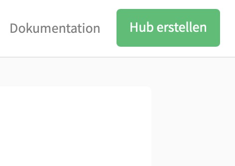

# Erste Schritte mit InstaHub

## Den eigenen Hub erstellen

***ACHTUNG:* Bitte bearbeiten Sie diesen Abschnitt sehr sorgfältig. Der Antragsprozess funktioniert so, aber Unaufmerksamkeiten führen schnell zu Verdruss.**

#### Aufgabe 3.1: Beantragen Sie einen eigenen InstaHub! {-}

Zur Arbeit mit InstaHub arbeitet jede:r Schüler\:in auf einem eigenen InstaHub. Es hat also jeder sein eigenes soziales Netzwerk.

Um einen InstaHub zu beantragen, gehen Sie wie folgt vor:

1. *Rufen* Sie InstaHub in Ihrem Browser (**nicht** Internet Explorer!)[^20] auf: [instahub.org](https://instahub.org/)!

   [^20]: InstaHub unterstützt alle gängigen Browser mit Ausnahme des Internet Explorers.

2. Klicken Sie oben Rechts auf `Hub erstellen`:

3. Sie sehen das folgende Formular (Ausschnitt):

4. _Notieren_ Sie sich __jetzt__ den Namen Ihres InstaHubs (im Beispiel: `rubinrot18`): ______________________. Wenn Sie den Namen Ihres Instahubs vergessen, **kommen Sie nur noch mit Hilfe Ihrer Lehrkraft rein!**

5. _Tragen_ Sie unter `Dein/e LehrerIn` den InstaHub-Namen Ihrer Lehrkraft ein. Dies ist <u>borowy</u>.

6. Unter `Name` (_nicht_ Benutzername!) tragen Sie bitte Ihren Vornamen ein. 

   _Tragen_ Sie in den folgenden Feldern Angaben ein wie Sie wollen. Denken Sie sich etwas aus, aber nehmen Sie außer der E-Mail-Adresse nicht Ihre echten Daten. 

   Die E-Mail-Adresse ist hilfreich, **um das Passwort zurücksetzen zu können**. Hier können Sie Ihre schulische Email-Adresse (\<pc-benutzername>@gy-har.herner.schule) verwenden!

7. Wählen Sie ein sicheres Passwort. 

8. _Senden_ Sie Ihre Registrierung durch einen Klick auf `Register` ab und ***warten* Sie nun darauf, dass Ihre Lehrkraft Ihren InstaHub frei schaltet**. Erst danach kann es für Sie weiter gehen!

## Am eigenen InstaHub anmelden

#### Aufgabe 3.2 Verwenden Ihres eigenen InstaHubs {-}

Nachdem Ihre Lehrkraft Ihren InstaHub nun freigeschaltet hat, können Sie Ihren eigenen InstaHub verwenden. Gehen Sie dazu wie folgt vor:

1. Melden Sie sich unter https://rubinrot18.instahub.org/login anmelden, wobei Sie `rubinrot18` durch den Namen Ihres InstaHubs ersetzen. Zum Glück haben Sie sich vorhin den Namen Ihres InstaHubs notiert... Ihr Benutzername lautet `admin`.

2. Nach dem erfolgreichen Login sehen Sie die derzeit noch recht leere Startseite von InstaHub:

   Sie erreichen die Startseite immer wieder, wenn Sie auf das **Fotoapparat-Symbol** oben links klicken.

3. Ein Klick auf das **Kompass-Symbol** bringt Sie zur Nutzerübersicht:

   Wie Sie sehen Sie, haben sich ganz ohne Ihr Zutun schon etwa 200 Nutzer\:innen an Ihrem InstaHub angemeldet.[^21]

[^21]:Keine Angst, diese Nutzer\:innen wurden beim Anlegen Ihres InstaHubs angelegt. Es handelt sich **nicht** um echte Menschen. Die Fotos stammen aus Qullen, die den freien Einsatz der Fotos erlauben.

4. Vielleicht werden Sie enttäuscht sein, denn InstaHub ist ja derzeit frei von Fotos. Es gibt irgendwie nur Nutzer\:innen, aber die tun nichts. Das kommt noch.

#### Aufgabe 3.5: Ausblick {-}
Das Hamburger Abendblatt hat wohlwollend über Ihr soziales Netzwerk berichtet. Wie viele der angemeldeten Nutzer\:innen wohnen in Hamburg? 

_Beschreiben_ Sie, wie Sie vorgehen würden, wenn Sie diese Frage mit Ihrem **bisherigen Kenntnisstand**, quasi "von Hand" beantworten müssten!

## Häufige Fehler beim Anmelden in InstaHub

- Sie auf dem richtigen Hub unterwegs sind, und nicht auf einem falschen oder direkt als Lehrkraft auf instahub.org und 
- Sie oben links immer den Namen des verwendeten InstaHubs sehen.
