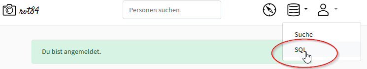
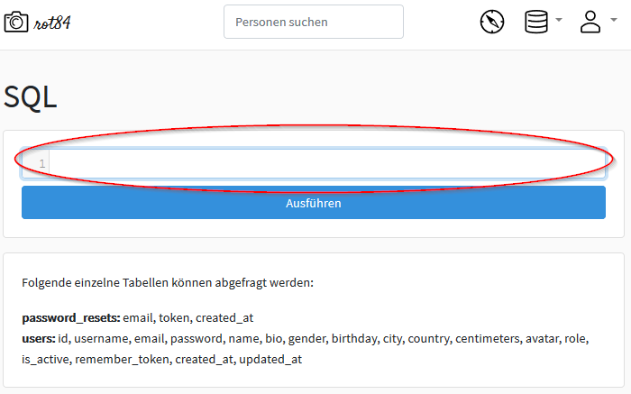
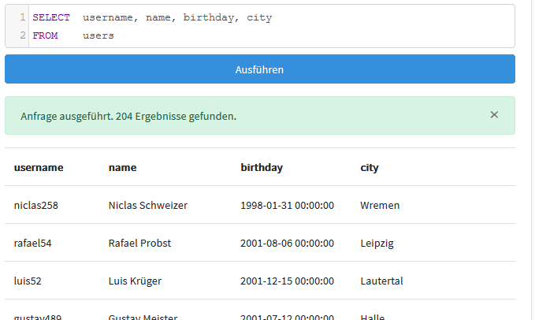

# Einfache SQL-Abfragen (Projektion)

## SQL kennen lernen

SQL (_structured query language_) ist eine Programmiersprache, mit der man auf Datenbanken zugreifen kann. SQL ist eine Vertreterin der so genannten **deklarativen Programmierung**, da man mit ihr nur das Ergebnis beschreibt, nicht aber den Weg dorthin. 

### Die erste SQL-Abfrage

1. _Rufen_ Sie Ihren InstaHub auf und melden Sie sich als `Admin` dort an!
   
1. Klicken oben rechts auf das Symbol *Datenbank* und wählen Sie ``SQL``:
   



3. Sie gelangen in den SQL-Editor:			



4. Setzen Sie den Cursor in das leere, im obigen Screenshot rot markierten, Eingabefeld und tippen Sie die folgende SQL-Abfrage exakt so ein:

   ```mysql
   SELECT  username, name, birthday, city 
   FROM    users	
   ```

   **Tipps:** Nach dem `SELECT` bzw. `FROM` tippen Sie die Tab-Taste, damit der Befehl übersichtlich aussieht. Am Ende der ersten Zeile können Sie `ENTER` drücken, um in eine neue Zeile zu wechseln. 

5. Klicken Sie auf `Ausführen`! Sie sehen nun eine Ergebnistabelle mit gut 200 Zeilen:



### Tipps:{-}

+ Beachten Sie, dass die Spaltennamen exakt mit den Bezeichnungen nach dem `SELECT`übereinstimmen!

+ SQL unterscheidet nicht zwischen Groß- und Kleinschreibung. Es ist aber üblich, die SQL-Befehle in GROSSBUCHSTABEN zu notieren. Halten Sie sich bitte an diese Gepflogenheit. 

+ Wenn Sie *alle* Spalten ausgeben wollen, können Sie statt alle Spalten aufzuzählen auch einfach ein ``*`` notieren, z. B.;   

  ```
  SELECT *
  FROM   users	
  ```

+   Wenn Sie statt einer Antwort wie der obigen eine englische Fehlermeldung bekommen, haben Sie bei der Eingabe des Befehls einen Fehler gemacht. Kontrollieren Sie noch einmal ganz genau, ob Sie irgendwo einen kleinen Fehler gemacht haben. Sind die Kommata wirklich da, wo sie sein sollen und sind es wirklich Kommata? Kein kleiner Tippfehler in den Spaltennamen?

#### Aufgabe 4.1: Erste SQL-Abfragen {-}

1. Welche Informationen der angemeldeten InstaHub-User:innen werden in der ``user``-Tabelle gespeichert?
2. Welche Körpergrößen haben unser Nutzer:innen?
3. Welche verschiedenen Werte kommen in der Spalte `role` vor?

## Dubletten aussortieren

Bei der Abfrage der Körpergrößen und der Werte für ``role`` fällt auf, dass das Ergebnis viele Duplikate enthält. Dies ist besonders bei der Abfrage der Werte für ``role`` störend, da eigentlich nur zwei unterschiedliche Werte vorkommen. Werfen wir einen Blick auf die folgende Abfrage:

``` mysql
SELECT	 role
FROM 	 users
```

Das Ergebnis ist eine lange Liste, welche die Rolle _jede:r einzelnen Nutzer:in_ zurückgibt. Da nur zwei unterschiedliche Rollen (``user`` und ``dba``) vorkommen, umfasst das Ergebnis zahlreiche Duplikate.

Probieren Sie es einmal mit einer Ergänzung der Projektion:

```mysql
SELECT	 DISTINCT role
FROM 	 users
```

Die Ergänzung der Projektion (``SELECT``) um den Befehl ``DISTINCT`` sorgt dafür, dass alle Zeilen aussortiert werden, die mehr als einmal vorkommen.

#### Aufgabe 4.2: Dubletten aussortieren {-}

_Erstellen_ Sie jeweils eine SQL-Abfrage, die folgenden verbalen Anfragen möglichst schön beantworten:

1. In welchen Städten haben wir bereits mindestens eine:n Nutzer:in?
3. In welchen Ländern haben wir bereits mindestens eine:n Nutzer:in?
2. Welche verschiedenen Werte kommen in der Spalte ``gender`` vor?


