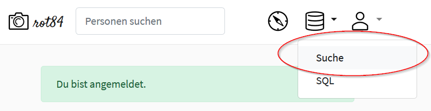
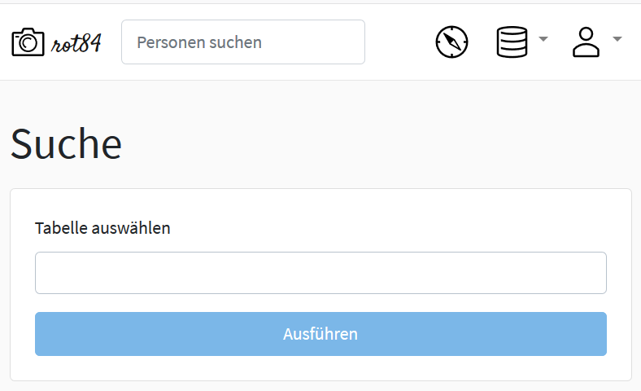
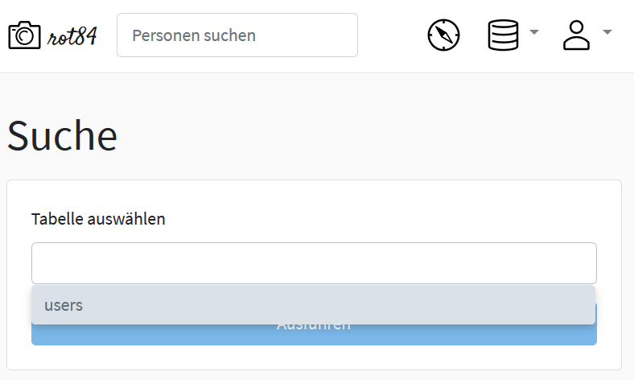
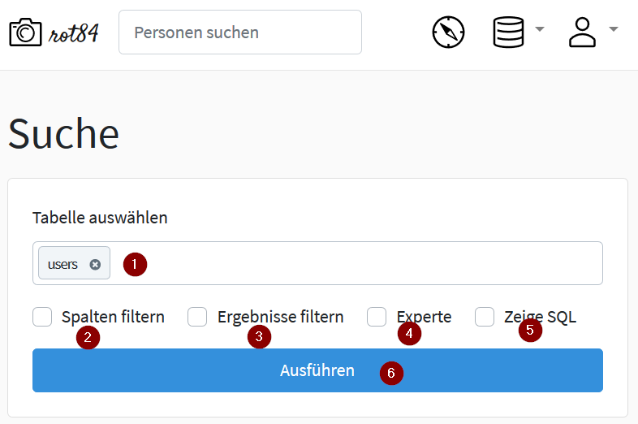
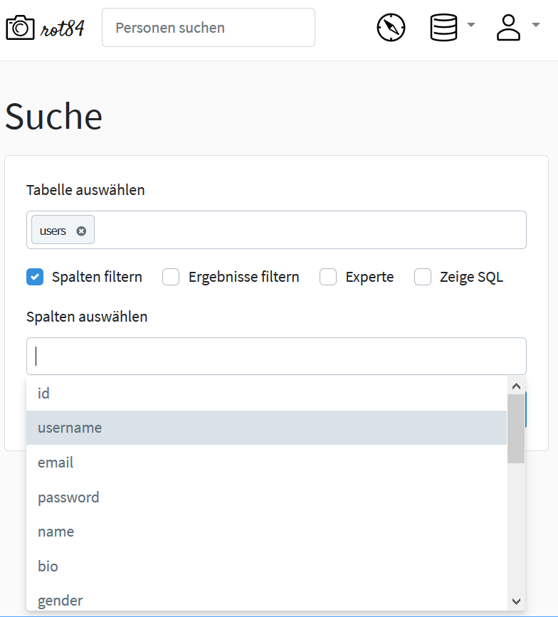
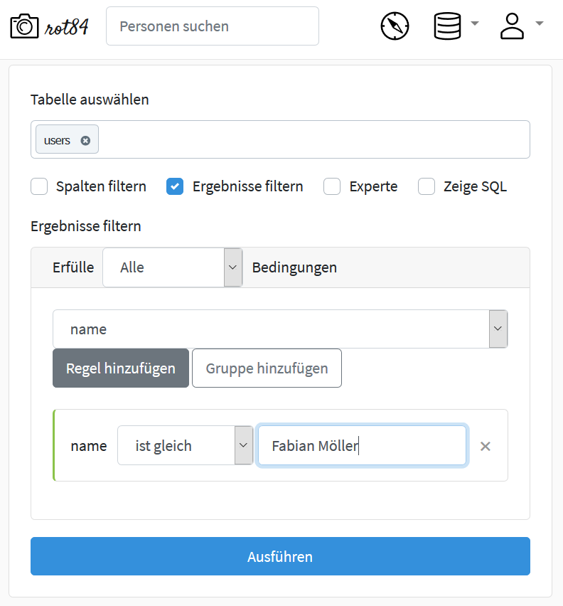
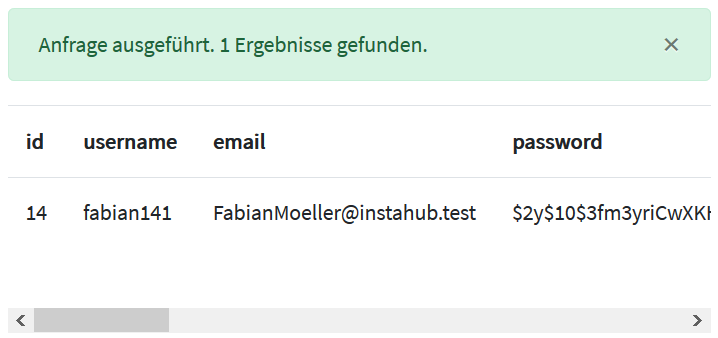

# Die Suchmaske

Viele IT-Systeme geben den Benutzer\*innen die Möglichkeit, ohne Kenntnis einer Abfragesprache mehr oder weniger einfache Anfragen an das System zu stellen. Sie heißen dort oft "erweiterte Suche", "Expertensuche" oder ähnliches.

Wir werden die Suchmaske in diesem Skript nur kurz streifen, da wir uns mit der Abfrage- und Manipulationssprache SQL beschäfigen wollen, da diese mächtiger ist.

## Die Suchmaske aufrufen

Sie gelangen wie folgt zur Suchmaske:

Klicken Sie auf der Startseite oben rechts das Datenbanken-Symbol, hinter dem sich ein Untermenu befindet, aus dem Sie  den Punkt `Suche` auswählen:

 

## Die Suchmaske verwenden

Die Suchmaske sieht zunächst sehr aufgeräumt aus:

Wenn Sie in das Feld `Tabelle auswählen` klicken, erscheint eine Drop-Down-Liste, aus der Sie eine Tabelle auswählen können:

Nachdem Sie eine Tabelle ausgewählt haben, verändert sich die Suchmaske:

Die einzelnen Elemente in der obigen Abbildung haben folgende Bedeutung:

1. Hier sehen Sie die Tabelle, die Sie ausgewählt haben und auf die sich Ihr Suchauftrag bezieht.
2. Wenn `Spalten filtern` ankreuzen, öffnet sich ein Bereich in dem Sie angeben können, welche der Spalten der Tabelle Sie in Ihre Abfrage einfügen wollen.  Diese Auswahl von Spalten wird in Datenbanken auch **Projektion** genannt:

3. Wenn Sie ``Ergebnisse filtern`` ankreuzen, können Sie Kriterien angeben, denen alle ausgegebenen Datensätze entsprechen müssen. Man spricht hier von **Selektion**. Die Details entnehmen Sie bitte dem nächsten Abschnitt "[Selektion in der Suchmaske]"
4. Das Auswahlfeld ``Experte`` führt zu einigen Optionen, mit deren Hilfe etwas komplexere Abfragen möglich sind. Diese Möglichkeit wird in diesem Skript nicht behandelt, da wir derartige Abfragen mit der Sprache SQL (siehe Kapitel 4) formulieren werden.
5. ``Zeige SQL``: Die in dem Formular eingegebene Suchabfrage wird in die Sprache SQL übersetzt und ausgegebn.
6. ``Ausführen``: Die formulierte Suchabfrage wird ausgeführt.

## Selektion in der Suchmaske

Die Selektion, also das Auswählen von Datensätzen aus einer Datenbank an Hand vorgegebener Kriterien ist die vielleicht wichtigste Aufgabe, die ein Datenbankmanagementsystem zu erledigen hat.

Wenn Sie die Daten von Fabian Möller anzeigen wollen, gehen Sie wie folgt vor:

1. Wählen Sie in der Suchmaske die Tabelle ``users`` aus.
2. Wählen Sie ``Ergebnisse filtern`` an.
3. Wählen Sie das Feld ``name`` aus und geben Sie ``ist gleich`` aus und tragen sie in das leere Feld den Namen ``Fabian Möller`` ein.
4. Klicken Sie auf ``Ausführen``.  InstaHub meldet folgendes Ergebnis:

Die Suchmaske kann noch mehr: Sie können mehrere Filterregeln angeben. Dann müssen Sie angeben, ob die Suchergebnisse *allen* Filterregeln oder *mindestens einer* entsprechen müssen.

#### Aufgabe 4.1 Einfache Abfragen mit der Suchmaske {-}

*Beantworten* Sie die folgenden Fragen mit Hilfe der Suchmaske! *Dokumentieren* Sie Ihre Lösung, z. B. mit Hilfe eines Screenshots.

1. Welche Mitglieder wohnen in Hamburg? Gesucht sind Name, Benutzername und Stadt.
2. Welche Mirglieder wurden nach dem 01.12.1998 geboren? Gesucht sind Name, Benutzername und Geburtstag. (Hinweis: Das Datum müssen sie als ``1998-12-01`` eingeben.)
3. Welche Mitglieder sind größer als 190 cm und nach dem 01.12.1998 geboren?  Gesucht sind Name, Benutzername und Geburtstag. 

