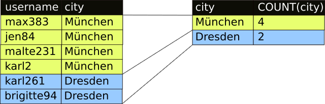

# SQL-Abfragen: Logik und Aggregate

## Logische Operatoren

#### Aufgabe 6.1 Analyse {-}

_Überlegen_ Sie zunächst, welche Ergebnisse die folgenden SELECT-Befehle liefern *könnten*! _Beschreiben_ Sie, welche Datensätze in der Ergebnistabelle enthalten sein werden!

```sql
-- Beispiel 1:
SELECT 	username, city 
FROM 	users 
WHERE 	city = "Berlin" AND name LIKE "Fabian%"
-- Beispiel 2:
SELECT 	username, city 
FROM 	users 
WHERE 	city = "Berlin" OR city = "Hamburg"
-- Beispiel 3:
SELECT 	username, city 
FROM 	users 
WHERE	city = "Berlin" AND NOT gender LIKE "female"
```
Die folgende Tabelle zeigt die Bedeutung der logischen Operatoren:

|`A` | `B` | `NOT A` | `A AND B` | `A OR B` |`NOT A AND B` | `NOT(A OR B)` |
|---- |------|----|---|---|---|---|
|`FALSE`|`FALSE`| `TRUE` |`FALSE`|`FALSE`|||
|`FALSE`|`TRUE`| `TRUE` |`FALSE`|`TRUE`|||
|`TRUE`|`FALSE`| `FALSE` |`FALSE`|`TRUE`|||
|`TRUE`|`TRUE`| `FALSE` |`TRUE`|`TRUE`|||

#### Aufgabe 6.2 Logikübung

_Vervollständigen_ Sie die beiden letzten Spalten in der obigen Tabelle!

#### Aufgabe 6.3 Mehrere logische Operatoren {-}

_Erstellen_ Sie _je_ eine SQL-Abfrage, die 

1. alle Berliner auflistet, die *Marc* heißen,
2. alle Leipziger Frauen auflistet,
3. alle Linas und Lorenas auflistet, 
4. alle Männer nach ihrer Körpergröße auflistet, die mindestens 16 Jahre alt sind und
5. alle Nutzer liefert, die weder männlich noch weiblich sind.

#### Aufgabe 6.4 Logische Operatoren mit Klammern {-}

_Erstellen_ Sie _je_ eine SQL-Abfrage (Tipp: Verwenden Sie Klammern wie beim Taschenrechner), die

1. alle Benutzer mit dem Namen "Xaver" auflistet, die nicht in München oder Nürnberg leben und
2. alle Benutzer\*Innen auflistet, die 10 cm größer als der Durchschnitt ihrer Geschlechtsgenossen sind. (Die Durchschnittsgröße von Männern beträgt in Deutschland 179,9 cm, die von Frauen 165,9 cm)

## Zusammenfassungen (Aggregate)

Bisher haben Sie bei Abfragen 

+ die Spalten, die angezeigt werden sollen, ausgewählt (Projektion) oder

+ die Zeilen, die im Ergebnis stehen sollen, ausgewählt (Selektion).


Aber was, wenn wir wissen wollen, wie groß unser größtes Mitglied in jeder Stadt ist? Oder wir für jede Stadt wissen wollen, wie viele Mitglieder wir dort haben?

Die Lösung hierfür heißt Aggregat (aggregieren: lat. _anhäufen)_. Die Idee ist in der folgenden Abbildung dargestellt:



Aggregate fassen also mehrere Zeilen der Quelltabellen zu einer einzigen Zeile in der Ergebnistabelle zusammen.

#### Aufgabe 6.4 Unser erstes Aggregat {-}

Der folgende SELECT-Befehl liefert für jede Stadt den größten und kleinsten Benutzer:

```sql
SELECT 	city AS "Stadt", MIN(centimeters) AS "kleinsteR", 
		MAX(centimeters) AS "groessteR"
FROM 	users 
GROUP BY city
```

_Probieren_ Sie den Befehl aus und _erklären_ Sie, wie er funktioniert. *Beachten* Sie dabei *alle* neuen SQL-Wörter.

`MAX` ist eine **Aggregatsfunktion**. Weitere Aggregatsfunktionen sind beispielsweise `COUNT`,  `SUM` und `AVG` (Durchschnitt, engl. _average_). 

Der folgende SQL-Befehl zählt die Mitglieder:

```sql
SELECT COUNT(username) AS "Registrierte Mitglieder" FROM users
```

#### Aufgabe 6.5 Aggregatsfunktionen {-}

_Erstellen_ Sie _je_ eine SQL-Abfrage, die

1. alle Werte des Feldes `gender` liefert und angibt, wie oft diese auftreten,
2. die durchschnittliche Größe aller Mitglieder in Dresden liefert und
3. das Geburtsdatum des jüngsten männlichen und des jüngsten weiblichen Mitglieds liefert.
4. die Anzahl aller Mitglieder pro Stadt ausgibt


