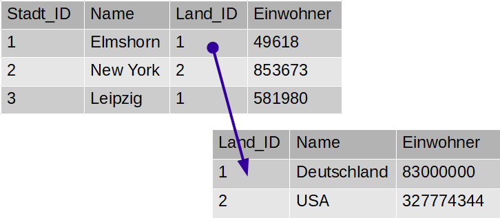
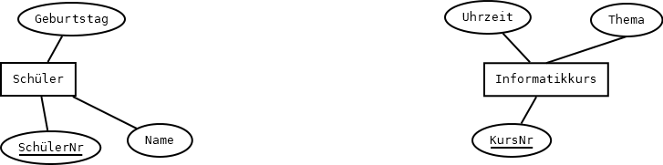
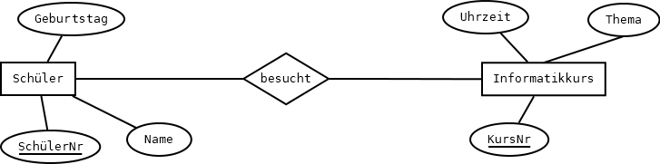
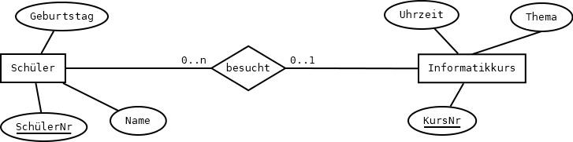

# Tabellen erstellen und das Entity-Relationship-Modell 

## CREATE TABLE

#### Aufgabe 9.1 Das erste CREATE TABLE verstehen{-}

_Erklären_ Sie was der folgende SQL-Befehl genau tut. Ziehen Sie dabei das Glossar im folgenden Abschnitt [Glossar zu SQL-Create] (oder eine SQL-Referenz Ihres Vertrauens)  zu Rate. 

Tipp: Es ist vielleicht zunächst hilfreich herauszufinden, wie die neue Tabelle und ihre Spalten heißen werden.

```sql
CREATE TABLE photos (
	id 			INT(4) UNSIGNED	NOT NULL	AUTO_INCREMENT,
	user_id		INT(4) UNSIGNED	NOT NULL,
  	description	VARCHAR(255)	NOT NULL,
   	url			VARCHAR(255)	NOT NULL,
    created_at	TIMESTAMP 		NOT NULL	DEFAULT now(),
    updated_at	TIMESTAMP		NOT NULL	DEFAULT now(), 
   	PRIMARY KEY (id),
   	FOREIGN KEY (user_id) 
    	REFERENCES users(id) 
		ON DELETE CASCADE
)
```

### Glossar zu SQL-Create

+ **`AUTO_INCREMENT`** bedeutet, dass bei jedem neu eingefügten Datensatz dieser Wert automatisch um 1 hochgezählt wird. Darum braucht man sich also nicht zu kümmern.
- **`DEFAULT`** regelt, welchen Wert ein Datensatz bekommt, wenn beim Anlegen des Datensatzes kein Wert angegeben wird. (engl. _default_: Standard, Vorgabe)
+ **`FOREIGN KEY`**: Diese Spalte ist ein Verweis auf eine andere Tabelle. Jeder Wert in dieser Spalte befindet sich in einer Spalte der Zieltabelle. Diese Spalte heißt in der aktuellen Tabelle **Fremdschlüssel**. Die Tabelle, auf die verwiesen wird, heißt **Zieltabelle**.

  Bei InstaHub ist die Zieltabelle die Tabelle `users` und die Spalte, in der dort gesucht werden soll ist die Spalte `id`. Wie fast immer ist der referenzierte Fremdschlüssel in der Zieltabelle der dortige Primärschlüssel (s. `PRIMARY KEY`).

  Jeder Wert eines Fremdschlüssels muss zwingend in der Zieltabelle enthalten sein. Das kontrolliert die Datenbank. Und damit sie das kann, deklariert man Fremdschlüssel als `FOREIGN KEY`.
   In der Tabelle ``Städte`` verweisen die Werte in der Spalte ``Land_ID`` auf die die Tabelle ``Länder`` und zwar auf die Spalte ``Land_ID``. In der Tabelle ``Länder`` ist ``Land_ID`` der **Primärschlüssel**. In der Tabelle ``Städte`` ist die Spalte ``Land_ID`` ein **Fremdschlüssel**, der auf eine Zeile in einer anderen Tabelle verweist. 

  Das Prinzip sehen Sie im folgenden Schaubild:



+  **`INT`** ist ein Datentyp. Jede Spalte  kann nur Werte einer bestimmten Art enthalten. Es geht also nicht, dass in einer Spalte mal eine Zahl, mal ein Text und dann wieder ein Datum steht. `INT (4)` bedeutet, dass in der Spalte ganze Zahlen (engl. _integer_) von -2.147.483.648 bis +2.147.483.647 stehen können. Da sie hier aber als `UNSIGNED` deklariert wurden, sind sie immer positiv und können von 0 bis 4.294.967.295  reichen. Die Zahl in Klammern ist von untergeordneter Bedeutung. Sie gibt an, wie viele Stellen zur Ausgabe der Zahl bereit gestellt werden sollen. 
+  **`NULL`** bedeutet nicht "0", sondern "nichts, leer". `NULL` ist nicht gleich etwas anderem, auch nicht dem Wert 0. Wenn eine Tabellenspalte in jeder Zeile einen Wert haben soll, kann man `NOT NULL` notieren, dann wird die Datenbank dort unter keinen Umständen erlauben, nichts einzutragen. Notiert man `NULL`, erlaubt man auch leere Tabellenzellen.
+  **`ON DELETE`**: Dies ist Teil der Deklaration eines Fremdschlüssels, siehe `FOREIGN KEY`. Diese Regel beantwortet die Frage, was passiert, wenn der Zieldatensatz gelöscht wird. `ON DELETE CASCADE` bedeutet, dass beim Löschen eines Datensatzes in der Tabelle `USERS` alle zugehörigen Datensätze in der Tabelle `photos` gelöscht werden. Würde man dies nicht vereinbaren, müssten zunächst alle Fotos des\*r Benutzer\*in gelöscht werden, damit der Datensatz in der Tabelle `users` gelöscht werden kann.
+  **`PRIMARY KEY`**:  Vereinfacht gesehen hat jede Tabelle eine Spalte, in der kein Wert doppelt vorkommt. Diese Spalte nennt man **Primärschlüssel**. Wenn man hier nach einem Wert sucht findet man also immer keine oder genau eine Zeile, niemals aber mehrere. Mit der Deklaration `PRIMARY KEY` geben Sie an, welche Spalte der Primärschlüssel ist.
+  **`TIMESTAMP`** ist ein Datum mit Uhrzeit. Das frühest mögliche Datum ist 1970, das spätest mögliche 2038.
+ **`VARCHAR`** ist ebenfalls ein Datentyp (s. `INT`). Bei `VARCHAR` handelt es sich um eine Zeichenkette variabler Länge. Die maximale Länge wird in Klammern angegeben.

### Weitere SQL-Datentypen

SQL verfügt über zahlreiche Datentypen. Leider wird nicht jeder Datentyp von jedem SQL-Server unterstützt oder gleich interpretiert. Die Datentypen in der folgenden Auswahl wird zwar in diesem Kapitel nicht verwendet, ist aber trotzdem wichtig:

| Datentyp                   | Bedeutung                                                    |
| -------------------------- | ------------------------------------------------------------ |
| ``DECIMAL(p, s)``          | Eine Zahl mit festem Nachkommateil. `s` gibt die Zahl der Nachkommastellen an, `p` die Zahl der Stellen insgesamt. Der Datentyp ist sehr geeignet für Geldbeträge. |
| ``CHARACTER LARGE OBJECT`` | Wie ``VARCHAR``, aber es gibt keinerlei obere Grenze, so dass ganze Textdokumente gespeichert werden können. Umständliche Handhabung, daher wird ``VARCHAR`` bevorzugt. |
| ``FLOAT``                  | Zahl mit gleitend vielen (engl. *to float*) Nachkommastellen, wie beim Taschenrechner. Achtung: Es kommen Rundungsungenauigkeiten vor. Der Datentyp ist geeignet für technische Zahlen und nicht für Geldbeträge. |
| ``SMALL INT``              | Kleiner Ganzzahlwert (meist -32. 768 bis +32 .767)           |
| ``CHAR(n)``                | Zeichenkette der festen Länge ``n``. Die Nutzung ist weniger aufwändig als ``VARCHAR``. |


#### Aufgabe 9.2 CREATE TABLE photos{-}

1. _Erzeugen_ Sie die Tabelle `photos` so wie zu Anfang dieses Kapitls angegeben. Achten Sie besonders auf die Datentypen und die Namen der Spalten. 
2. _Füllen_ Sie die Tabelle mit Hilfe der von Ihrer Lehrkraft bereitgestellten Datei mit Daten!
3. _Schauen_ Sie sich in Ihrem InstaHub um!
4. _Überlegen_ Sie sich, wie die Fotos in den Hub gekommen sind. Sie haben ja schließlich nur eine Textdatei hochgeladen...

## Das Entity-Relationship-Modell

Wir haben nun drei Tabellen in unserer Datenbank. Um den Überblick zu behalten, wäre es schön, die Tabellenstrukturen grafisch darzustellen. Hierzu gibt es das Entity-Relationship-Modell, kurz **ER-Modell** oder ERM. Ein ER-Modell besteht aus den folgenden vier Elementen:

1. **Gegenstände (Entities)**: Eine *Entität* (engl. _entity_) stellt eine Klasse von *Objekten* der *realen* Welt im ER-Modell ab. Z. B. `Produkt`, `Kunde`, `Schüler` oder `Informatikkurs`. (Sie sehen, dass Objekte nicht unbedingt gegenständlich sein müssen.) Entities werden in ER-Modellen als Rechtecke dargestellt:


2. **Attribute**: Entitäten und Beziehungen haben _Eigenschaften_, die durch _Attribute_ beschrieben werden. Diese Attribute findet man in der Datenbank in den Tabellenspalten. Typische Eigenschaften für die Entität `Produkt` könnten z. B. Bezeichnung, Gewicht, Preis und Artikelnummer sein.

   Attribute werden in ER-Modellen als Ovale an die Entitäten angehängt. Die Primärschlüssel heißen im ER-Modell eigentlich _identifizierende Attribute_ und werden unterstrichen:



3. **Beziehungen (Relationships)**: Ein *Relationship* stellt eine Beziehung zwischen den Objekten der realen Welt dar. Z. B. die Beziehungen _kaufte_ zwischen `Kunde` und `Produkt` _besucht_ zwischen den Entitäten `Schüler` und `Informatikkurs`. Relationships verbinden _immer_ genau zwei Entitäten. Realationships werden als Raute dargestellt:



4. **Kardinalität**: Beziehungen verbinden nicht immer genau ein Exemplar einer Entität mit genau einem Exemplar einer anderen Entität. So kann ein Kunde mehrere Produkte gekauft haben.

   Kardinalitäten werden leider sehr verschieden notiert. Wir verwenden hier die in der folgenden Abbildung verwendete Notation: Ein bestimmte\*r Schüler*In hat genau einen (`1..1`) Informatikkurs und jeder Informatikkurs wird von 0 bis beliebig vielen Schüler\*Innen (`0..n`) besucht.)



**Bitte beachten Sie:** Die **Fremdschlüssel** werden im ER-Modell *nicht* notiert, nur die **Primärschlüssel**. Die Fremdschlüssel werden erst beim Umsetzen der ER-Modells in Tabellen ergänzt. Im obigen Beispiel müsste in der Tabelle `Informatikkurs` der Primärschlüssel der Entität `Schüler`, `SchülerNr` eingefügt werden. Wir werden uns in Abschnitt 10.3 und in Kapitel 17 näher mit diesem Thema beschäftigen.

#### Aufgabe 9.3 Das ER-Modell von InstaHub (1){-}

_Erstellen_ Sie ein ER-Modell Ihrer InstaHub-Datenbank! Bei den Attributen wählen Sie einige exemplarische aus.
