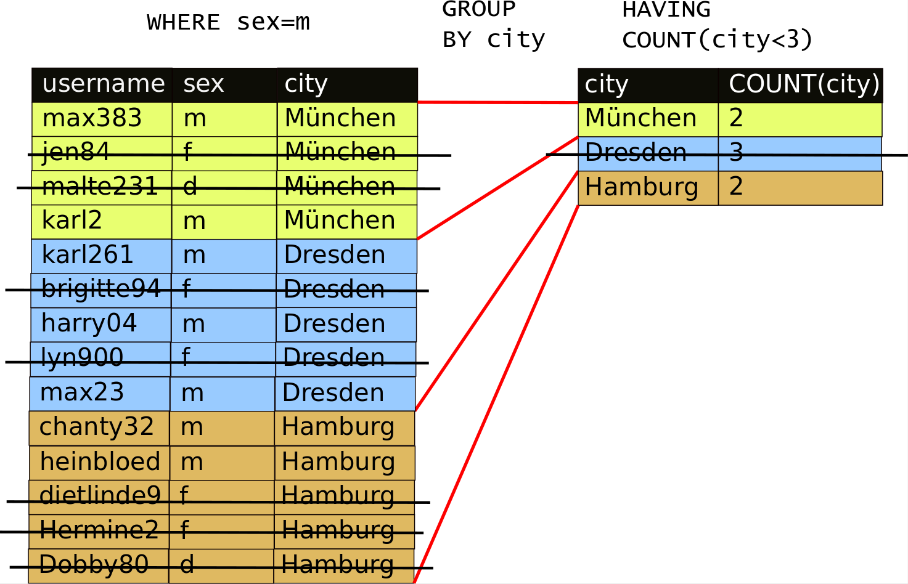

# Komplexe SQL-Abfagen

## Aggregate selektieren

Einige Nutzer\*innen haben noch immer keine Fotos auf InstaHub geliket. Diese sollen nun per E-Mail dazu ermuntert werden. Geben Sie eine SQL-Abfrage an, die die E-Mail-Adresse und den Namen der betroffenen Nutzer\*innen liefert!

Als ersten Schritt schreiben Sie mit Ihrem derzeitigen Kenntnisstand vielleicht eine Abfrage, die zu allen Nutzer\*innen die Zahl aller von ihnen geliketen Nutzer\*innen liefert, z. B. etwas wie:

```sql
SELECT   users.id, users.email, COUNT(___________)
FROM     users __________ JOIN likes 
         ON (________ = likes.user_id)
GROUP BY _________
```

#### Aufgabe 12.1: Vervollständigen Sie die SQL-Abfrage {-}

_Vervollständigen_ Sie die obige Abfrage!

_Kontrollieren_ Sie Ihre Lösung mit Hilfe des folgenden QR-Codes:


Aber wie bekommen Sie nur diejenigen Nutzer\*innen angezeigt, bei denen die `COUNT`-Spalte den Wert `0` enthält? Sie könnten probieren, es mit einer `WHERE`-Klausel zu versuchen, aber das wird erfolglos sein, weil `WHERE` die Datensätze selektiert, die danach mittels `GROUP BY` gruppiert werden und nicht die gruppierten Ergebniszeilen filtert. Hierzu benötigen Sie die Klausel `HAVING`. Sie funktioniert fast genauso wie die `WHERE`-Klausel, nur dass sie aus denen durch `GROUP BY` erstellten aggregierten Zeilen diejenigen auswählt, die einem Kriterium entsprechen. Dies wird in der folgenden Abbildung veranschaulicht:



#### Aufgabe 12.2: SQL-Abfrage vervollständigen {-}

_Vervollständigen_ Sie Ihre SQL-Abfrage aus Aufgabe 12.1, so dass sie nun nur noch diejenigen Benutzer\*innen liefert, die keine Fotos geliket haben!

#### Aufgabe 12.3: Aggregate selektieren {-}

_Erstellen_ Sie jeweils eine SQL-Abfrage:

1. Welche Fotos wurden bisher gar nicht oder maximal einmal geliket?
2. Welche Nutzer\*innen haben noch kein Foto kommentiert?
3. Welche Fotos wurden bisher noch gar nicht oder maximal einmal kommentiert?

#### Aufgabe 12.4: Einzelgänger\*innen finden (schwer) {-}

Einige Nutzer\*innen folgen noch immer niemanden auf InstaHub. Diese sollen nun per E-Mail dazu ermuntert werden. Geben Sie eine SQL-Abfrage an, die die E-Mail-Adresse und den Namen der betroffenen Nutzer\*innen liefert!

Erstellen Sie eine entsprechende Abfrage! 

**Hinweise:** 

- Diese Aufgabe ist deutlich schwerer als man zunächst meint. 
- Es ist mehr als ein\*e Benutzer\*in betroffen.
- Tasten Sie sich am besten schrittweise an die (vielleicht überraschende) Lösung heran, denn ``HAVING COUNT(...)=0``  funktioniert leider nicht.

## Anfragen verschachteln 1: ``UNION`` und ``IN``

Gesucht sind alle Benutzer\*innen in  Leipzig, Dresden und Hamburg. In diesem Abschnitt sehen wir uns verschiedene Lösungsansätze für diese Anforderung an.

### Lösung 1: `OR`

Sie können diese Anforderung bereits umsetzen, und zwar mit Hilfe des `OR`-Operators umsetzen:

```
SELECT  username, city, name 
FROM    users
WHERE   city = "Leipzig" OR city = "Dresden" OR
        city = "Hamburg"
```

### Lösung 2: `IN`

Eine andere Möglichkeit ist der ``IN`` Operator:

```
SELECT  username, city, name 
FROM    users
WHERE   city IN ("Leipzig", "Dresden", "Hamburg")
```

Richtig mächtig wird der ``IN``-Operator aber, wenn Sie berücksichtigen, dass in die Klammern ein ``SELECT``-Befehl gesetzt werden kann. Das brauchen wir zwar zur Lösung unserer Aufgabe an dieser Stelle nicht, aber es würde wie folgt aussehen:

```
SELECT  username, city, name, created_at
FROM    users
WHERE   city IN (
	SELECT  DISTINCT city
	FROM    users
    WHERE   created_at < "2017-08-31" 
)
```

Dieser Befehl liefert die Namen aller Benutzer\*innen, die in einer Stadt wohnen, in der jemand wohnt, der vor September 2017 in InstaHub angemeldet war. (Wofür auch immer die Geschäftsleitung das wissen wollte... ;-))

### Lösung 3: ``UNION``

Sie können die Ergebnisse zweier SQL-Anfragen mit Hilfe des SQL-Befehls ``UNION`` zusammenfügen:

```mysql
SELECT  username, city, name 
FROM    users
WHERE   city = "Leipzig"

UNION

SELECT  username, city, name 
FROM    users
WHERE   city = "Dresden"

UNION

SELECT  username, city, name 
FROM    users
WHERE   city = "Hamburg"
```

Dabei muss die Zahl der Ergebnisspalten der Teiltabellen übereinstimmen.

#### Aufgabe 12.5: Unterwegs für die Kriminalpolizei {-}

Auf Grund einer Anzeige durch ein InstaHub-Mitglied ist die Kripo auf Ihren InstaHub aufmerksam geworden. Es besteht der Verdacht, dass auf Ihrem InstaHub volksverhetzende Äußerungen verbreitet werden. Menschen zweifelhafter Gesinnung sollen ihr Unwesen treiben und harmlose Bilder mit Bezügen zu Adolf Hitler kommentieren. Ihnen wird ein richterlicher Beschluss präsentiert, der Sie dazu verpflichtet, folgende Daten herauszugeben:

1. Eine Liste mit allen Benutzer\*innen (Name, E-Mail-Adresse, Geburtstagsdatum), die einschlägig kommentierten Fotos ebenfalls geliket, kommentiert oder hochgeladen haben. Jede\*r Nutzer\*in darf nur einmalig auf der Liste stehen, es ist nicht wichtig, zu wissen _warum_ diese\*r Nutzer\*in auf die Liste gelangt ist.
2. Eine Liste _aller_ Kommentare, die die fraglichen Nutzer\*innen abgegeben haben.

## ``CASE``

Für die folgende Aufgabe können Sie den ``CASE``-Operator benutzen. Hier sehen Sie ihn in freier Wildbahn:

```my
SELECT   url, COUNT(likes.photo_id) AS Anzahl,
         CASE 
             WHEN COUNT(likes.photo_id)>10 THEN "***"
             WHEN COUNT(likes.photo_id)>5 THEN "**"
             WHEN COUNT(likes.photo_id)>1 THEN "*"
             ELSE "-"
         END AS Sterne
FROM     photos JOIN likes ON (photos.id = likes.photo_id)
GROUP BY photos.id
ORDER BY COUNT(likes.photo_id) DESC 
```

#### Aufgabe 12.7: Texte generieren

1. Die Geschäftsleitung wünscht einen Bericht, in dem hinter jede\*m Nutzer\*in die Zahl der erhaltenen Likes steht und je nach Geburtsdatum der Text "minderjährig" bzw. "volljährig".
2. Erweitern Sie die Abfrage aus der vorangegangen Aufgabe um eine von Ihnen festgelegte Sternebewertung für die Zahl der für alle hochgeladenen Fotos erhaltenen Likes.

## Anfragen verschachteln 2: ``EXISTS``, ``ANY`` und ``ALL`` und ``NULL``

- Dieser Abschnitt wird noch bearbeitet.

## Zusammenfassende Aufgaben

- Dieser Abschnitt wird noch bearbeitet.