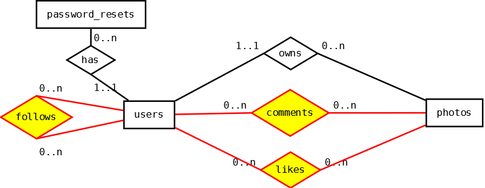

# SQL- und ER-Modell-Cheat-Sheet

## SQL

### Einfache SQL-Abfragen

```sql
SELECT 	username AS "Name", city AS "Stadt"
FROM 	users 
WHERE 	city = "Berlin" AND NOT name LIKE "%Ma_er"
```

- Logische Operatoren: ``AND``, ``OR``, ``NOT``
- Vergleiche: ``>``, ``<``, ``>=``, ``<=``, ``=``, ``LIKE``
- Duplikate in einer Spalte ausschließen: ``DISTINCT``
- Sortieren: ``ORDER BY``
- Zahl der Ausgabezeilen begrenzen: ``LIMIT``

### Aggregate

```sql
SELECT 	city, MIN(centimeters), MAX(centimeters)
FROM 	users 
GROUP BY city
```

- Aggregatfunktionen: ``AVG``, ``MIN``, ``MAX``, ``COUNT``, ``SUM``
- Aggregate filtern: ``HAVING``

### INSERT

```sql
INSERT
INTO	users (
		username, email, password, 
   		name, bio, gender,
   		birthday, city, country, 
   		centimeters, avatar, role, 
   		is_active, remember_token, created_at, 
   		updated_at
		) 
VALUES	(
   		'guenther37', 'guenther@instahub.app', '12345',
		'Günther Müller', 'Günther mag Kartoffeln', 'male',
		'2006-06-06 00:00:00', 'Leipzig', 'Deutschland',
		'173', 'avatar.png', 'user',
		'0', NULL, now(), 
   		now()
		)
```

### UPDATE

```sql
UPDATE	users 
SET		country = "Deutschland"
WHERE	country = "DDR"
```

### DELETE

```sql
DELETE FROM	users 
WHERE		birthday > "2018-01-01"
```

### CREATE

```sql
CREATE TABLE photos (
	id 			INT(4) UNSIGNED	NOT NULL	AUTO_INCREMENT,
	user_id		INT(4) UNSIGNED	NOT NULL,
  	description	VARCHAR(255)	NOT NULL,
   	url			VARCHAR(255)	NOT NULL,
    created_at	TIMESTAMP 		NOT NULL	DEFAULT now(),
    updated_at	TIMESTAMP		NOT NULL	DEFAULT now(), 
   	PRIMARY KEY (id),
   	FOREIGN KEY (user_id) 
    	REFERENCES users(id) 
		ON DELETE CASCADE
)
```

Datentypen: 
- ``INT`` -  ganze Zahlen
- ``SMALL INT`` - ganze Zahlen, meist zwischen -32.768 und +32.767
- ``TIMESTAMP`` - Datum und Uhrzeit
- ``VARCHAR(n)`` - Zeichenkette der variablen Länge _n_
- ``DECIMAL(p, s)`` - _p_ Stellen insgesamt, _s_ davon sind Nachkommastellen
- ``FLOAT`` - Gleitkommazahl (wie beim Taschenrechner)
- ``CHAR (n)`` - Zeichenkette fester Länge

### JOIN

```sql
SELECT	count(users.id) 
FROM	users JOIN photos			
		ON (users.id = user_id)
WHERE	username="aaron113"
```

- ``LEFT JOIN`` - Alle Datensätze der linken Tabelle, auch wenn es keinen passenden Datensatz in der rechten Tabelle gibt.
- ``RIGHT JOIN``
- ``INNER JOIN`` - identisch mit ``JOIN``
- ``NATURAL JOIN`` - identisch mit ``JOIN``, wobei alle Spalten mit identischen Namen in die ``ON``-Klausel übernommen werden.

### Verschachtelungen

- ``WHERE city IN ("Dortmund", "Essen", "Köln")``
- ``WHERE city IN (SELECT city FROM users WHERE ...)``
- ``SELECT ... UNION SELECT ... ``

### CASE

```my
SELECT   url, COUNT(likes.photo_id) AS Anzahl,
         CASE 
             WHEN COUNT(likes.photo_id) > 10 THEN "***"
             WHEN COUNT(likes.photo_id)>5 THEN "**"
             WHEN COUNT(likes.photo_id)>1 THEN "*"
             ELSE "-"
         END AS Sterne
FROM     photos JOIN likes ON (photos.id = likes.photo_id)
GROUP BY photos.id
ORDER BY COUNT(likes.photo_id) DESC 
```

## ER-Diagramme

